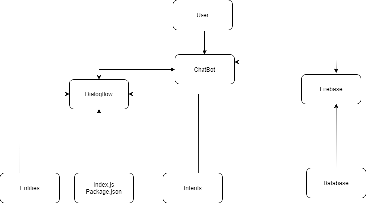

# YOYO PizzaBot-Dialogflow
PizzaBot 🤖 🍕used for ordering pizza 🍕🍕, created uisng dialogflow and firebase . This is an assignment from Yellow Messenger.

## Check this link out for ordering the pizza with the help of bot
  <a href="https://rb.gy/xo3fha">https://rb.gy/xo3fha</a>
    
## Instructions for The PizzaBot
   * Start with hi or hello
   * Type "order" or "pizza" to order the pizza.
   * Bot will ask for which pizza the customer requires and other stuffs like size,crust,toppings,count.
   * Bot will ask for customer details like name ,adress, phone number.
   * Bot will generate a unique order id for each order.
   * The user can check their order using their unique order id .
   * User has to type "id" for checking the status.
   * Bot will ask to enter the order id .
   * If the entered id is fetched from the firebase database it will print accordingly.
   * All the entered data is stored in firebase database.
   
 ## Architecture
    
 
    
